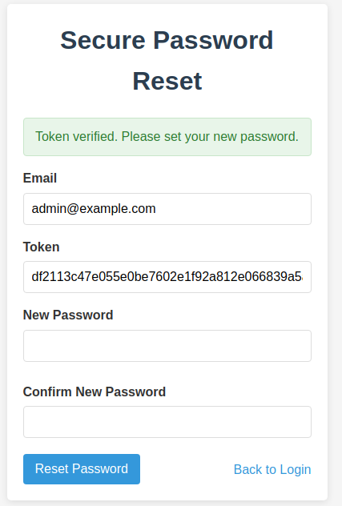

# Secure Authentication Implementation

This document details the security vulnerabilities in the original authentication system, their causes, and how they were addressed in the secure implementation. Each section deals with a specific vulnerability with code examples from both the vulnerable and secure versions.

## 1. SQL Injection Vulnerability

### The Problem

SQL Injection occurs when user input is directly incorporated into SQL queries without proper sanitization, allowing attackers to manipulate the query's structure.

**Vulnerable Code (models/user.js)**:
```javascript
// Vulnerable authentication with string concatenation
authenticate: (username, password, callback) => {
  // Direct string interpolation - SQL Injection vulnerability
  const query = `SELECT * FROM users WHERE username = '${username}' AND password = '${password}'`;
  console.log('[VULNERABLE] Executing query:', query);
  
  db.get(query, callback);
}
```

**Exploit**:
Using input like `admin' --` for the username bypasses authentication.

### Solution

**Secure Code**:
```javascript
// Secure authentication using parameterized queries and password hashing
authenticate: async (username, password) => {
  try {
    // Parameterized query - safe from SQL injection
    const user = await dbGet('SELECT * FROM users WHERE username = ?', [username]);
    
    if (!user) {
      return null;
    }
    
    // Verify password with bcrypt
    const passwordMatch = await bcrypt.compare(password, user.password);
    
    if (passwordMatch) {
      return user;
    }
    
    return null;
  } catch (error) {
    console.error('Error authenticating user:', error);
    throw error;
  }
}
```

The test with SQLmap shows that despite running at maximum level (5) and risk (3), was unable to identify any injectable parameters :


**Security Improvements**:
1. **Parameterized Queries**: Using `?` placeholders and passing parameters separately prevents SQL injection
2. **Password Hashing**: Instead of comparing plaintext passwords in the query, we retrieve the user first and then compare the hashed password


## 2. Plaintext Password Storage

### The Problem

The vulnerable application stores passwords in plaintext, exposing all user credentials if the database is compromised.

**Vulnerable Code (config/db.js)**:
```javascript
// Insert demo users with plaintext passwords
const users = [
  { username: 'admin', password: 'chocolate', email: 'admin@example.com', is_admin: true },
  { username: 'john', password: '987654321', email: 'john@example.com', is_admin: false }
];

const stmt = db.prepare('INSERT INTO users (username, password, email, is_admin) VALUES (?, ?, ?, ?)');
users.forEach(user => {
  stmt.run(user.username, user.password, user.email, user.is_admin);
});
```

### The Solution

**Secure Code**:
```javascript
// Hash passwords with bcrypt before storing
const saltRounds = 12;

// Demo users with securely hashed passwords
const users = [
  { 
    username: 'admin', 
    password: await bcrypt.hash('chocolate', saltRounds), 
    email: 'admin@example.com', 
    is_admin: true 
  },
  { 
    username: 'john', 
    password: await bcrypt.hash('987654321', saltRounds), 
    email: 'john@example.com', 
    is_admin: false 
  }
];
```


**Security Improvements**:
1. **Password Hashing**: Using bcrypt with an appropriate cost factor (12)
2. **Salt Integration**: Bcrypt automatically generates and stores a unique salt with each password
3. **Computational Cost**: The high cost factor makes brute-force attacks impractical


## 3. User Enumeration Vulnerability

### The Problem

The application returns different error messages for invalid usernames vs. invalid passwords, allowing attackers to discover valid usernames.

**Vulnerable Code (routes/auth.js)**:
```javascript
// Different error messages based on username existence
if (existingUser) {
  return res.status(401).json({ error: 'Incorrect password' });
} else {
  return res.status(401).json({ error: 'User not found' });
}
```

### The Solution

**Secure Code**:
```javascript
// Generic error message - doesn't reveal if username exists
return res.status(401).json({ error: 'Invalid username or password' });
```


**Security Improvements**:
1. **Generic Error Messages**: Using the same error regardless of whether the username exists or the password is incorrect
2. **Consistent Response Timing**: The secure implementation ensures authentication takes roughly the same time whether the username exists or not to prevent timing attacks


## 4. Brute Force Vulnerability

### The Problem

The vulnerable application has no protection against repeated login attempts, allowing attackers to try many password combinations.

**Vulnerable Code**: No rate limiting or account lockout mechanism exists.

### The Solution

**Secure Code (models/user.js)**:
```javascript
// Increment failed attempts and potentially lock the account
const failedAttempts = (user.failed_login_attempts || 0) + 1;
let lockedUntil = null;

// Lock account after 5 failed attempts for 15 minutes
if (failedAttempts >= 5) {
  lockedUntil = now + (15 * 60 * 1000); // 15 minutes
}

await dbRun(
  'UPDATE users SET failed_login_attempts = ?, account_locked_until = ? WHERE id = ?',
  [failedAttempts, lockedUntil, user.id]
);
```

**Additional Rate Limiting (routes/auth.js)**:
```javascript
// Rate limiting middleware for login attempts
const loginLimiter = rateLimit({
  windowMs: 15 * 60 * 1000, // 15 minutes
  max: 5, // 5 requests per window per IP
  standardHeaders: true,
  legacyHeaders: false,
  message: {
    error: 'Too many login attempts from this IP, please try again after 15 minutes'
  }
});

// Apply the rate limiter to the login route
router.post('/login', loginLimiter, /* other middleware */, async (req, res) => {
  // Login logic
});
```


**Security Improvements**:
1. **IP-based Rate Limiting**: Restricts number of attempts per IP address
2. **Account Lockout**: Temporarily locks accounts after multiple failed attempts
3. **Failed Attempt Tracking**: Keeps track of failed login attempts for security monitoring


## 5. Weak Password Reset Tokens

### The Problem

The vulnerable application uses predictable, short (4-digit) reset tokens that can be easily brute-forced.

**Vulnerable Code (models/user.js)**:
```javascript
// Generate a weak, predictable token
const timestamp = Date.now();
const token = (timestamp % 10000).toString().padStart(4, '0'); // Just a 4-digit number
const expiry = timestamp + 3600000; // 1 hour expiry
```

### The Solution

**Secure Code**:
```javascript
// Generate a secure random token (32 bytes = 64 hex chars)
const token = crypto.randomBytes(32).toString('hex');
// Token expires in 15 minutes
const expiry = Date.now() + (15 * 60 * 1000);
```



**Security Improvements**:
1. **Cryptographically Secure Tokens**: Using crypto.randomBytes() for unpredictable tokens
2. **Sufficient Token Length**: 32-byte (256-bit) tokens are virtually impossible to guess
3. **Short Expiration Time**: 15-minute expiration limits the window of opportunity for attacks
4. **One-time Use**: Tokens are invalidated after use


## 6. Parameter Tampering Vulnerability

### The Problem

The vulnerable application relies on client-side parameters for authorization decisions.

**Vulnerable Code (routes/auth.js)**:
```javascript
// Vulnerable: Relies on client-side parameter for authorization
const isAdmin = req.query.isAdmin === 'true' || req.query.admin === 'true';

if (!isAdmin) {
  return res.status(403).json({ error: 'Unauthorized' });
}

User.getAllUsers((err, users) => {
  if (err) {
    return res.status(500).json({ error: 'Database error' });
  }
  
  res.json({ users });
});
```

### The Solution

**Secure Code**:
```javascript
// JWT verification middleware
const verifyToken = (req, res, next) => {
  const token = req.headers.authorization?.split(' ')[1]; // Bearer TOKEN format
  
  if (!token) {
    return res.status(401).json({ error: 'Access denied. No token provided.' });
  }
  
  try {
    const decoded = jwt.verify(token, JWT_SECRET);
    req.user = decoded;
    next();
  } catch (error) {
    res.status(401).json({ error: 'Invalid token. Please log in again.' });
  }
};

// Admin role check middleware
const isAdmin = (req, res, next) => {
  if (!req.user || !req.user.isAdmin) {
    return res.status(403).json({ error: 'Access denied. Admin privileges required.' });
  }
  next();
};

// Secure admin route with proper authorization
router.get('/admin/users', verifyToken, isAdmin, async (req, res) => {
  try {
    const users = await User.getAllUsers();
    res.json({ users });
  } catch (error) {
    console.error('Error fetching users:', error);
    res.status(500).json({ error: 'Server error fetching users' });
  }
});
```


**Security Improvements**:
1. **Server-side Authentication**: Using JWT tokens for authentication
2. **Role-based Authorization**: Verifying admin status on the server-side
3. **Middleware Chain**: Separating authentication and authorization concerns


## 7. Insecure Session Management

### The Problem

The vulnerable application stores user data in localStorage and has no proper session management.

**Vulnerable Code (frontend/js/script.js)**:
```javascript
// Store user data in localStorage (vulnerable)
localStorage.setItem('user', JSON.stringify(data.user));
```

### The Solution

**Secure Code (backend/routes/auth.js)**:
```javascript
// Generate JWT token
const token = jwt.sign(
  { 
    id: user.id,
    username: user.username,
    email: user.email,
    isAdmin: user.is_admin
  },
  JWT_SECRET,
  { expiresIn: JWT_EXPIRY }
);

// Return success with JWT token
res.json({ 
  success: true, 
  message: 'Login successful',
  token
});
```

**Secure Frontend Implementation**:
```javascript
// Store JWT token in httpOnly cookie or SessionStorage (not localStorage)
// Send the token with each request
fetch('/api/admin/users', {
  headers: {
    'Authorization': `Bearer ${token}`
  }
})
```

**Security Improvements**:
1. **JWT Tokens**: Signed tokens that cannot be tampered with
2. **Token Expiration**: Automatic session timeout after a set period
3. **Secure Storage**: Using HTTP-only cookies when possible (prevents XSS attacks)
4. **Authorization Headers**: Using proper Authorization headers for API requests

## 8. Additional Security Enhancements

### Input Validation

**Secure Code (routes/auth.js)**:
```javascript
// Validation middleware using express-validator
router.post('/login', [
  body('username').trim().escape().notEmpty(),
  body('password').notEmpty()
], async (req, res) => {
  const errors = validationResult(req);
  if (!errors.isEmpty()) {
    return res.status(400).json({ errors: errors.array() });
  }
  
  // Proceed with validated input
});
```

### Security Headers

**Secure Code (server.js)**:
```javascript
// Security middlewares
app.use(helmet()); // Adds various HTTP headers for security

// Additional headers
res.setHeader('X-Content-Type-Options', 'nosniff');
res.setHeader('X-Frame-Options', 'DENY');
res.setHeader('Content-Security-Policy', "default-src 'self'");
```

### Proper Error Handling

**Secure Code (server.js)**:
```javascript
// Error handling middleware
app.use((err, req, res, next) => {
  console.error(err.stack);
  
  // Don't expose error details in production
  const message = process.env.NODE_ENV === 'production' 
    ? 'Something went wrong' 
    : err.message;
    
  res.status(500).json({ error: message });
});
```

## Conclusion

The secure implementation addresses all vulnerabilities found in the original application by implementing industry best practices:

1. **Query Parameterization**: Preventing SQL injection
2. **Password Hashing**: Protecting stored credentials
3. **Generic Error Messages**: Preventing user enumeration
4. **Rate Limiting and Account Lockout**: Preventing brute force attacks
5. **Secure Random Tokens**: Preventing token guessing
6. **JWT-based Authentication**: Ensuring proper session management
7. **Server-side Authorization**: Preventing parameter tampering
8. **Input Validation**: Preventing various injection attacks
9. **Security Headers**: Mitigating XSS and other client-side attacks
10. **Proper Error Handling**: Preventing information disclosure

These improvements create a robust, secure authentication system that follows OWASP recommendations and modern security standards.